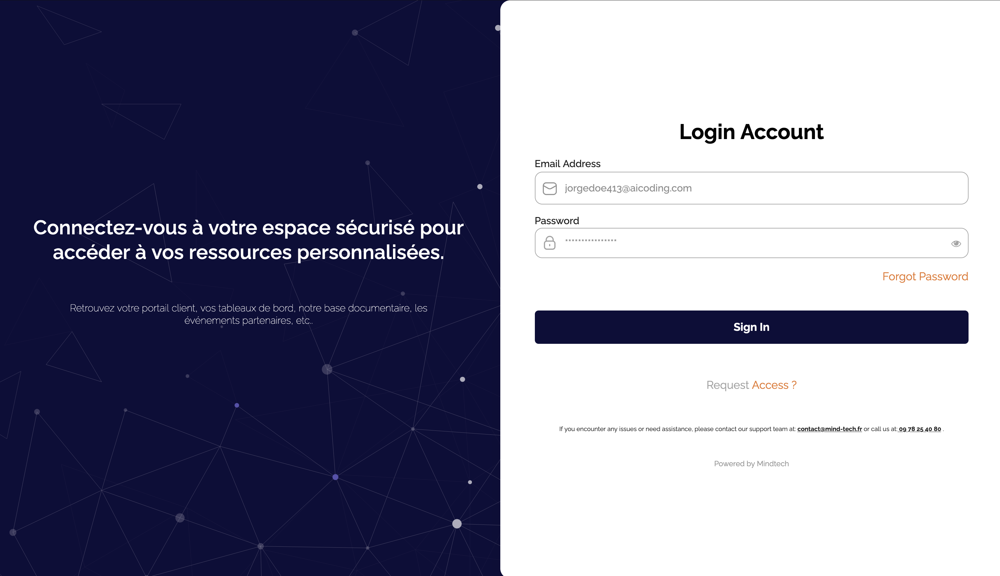
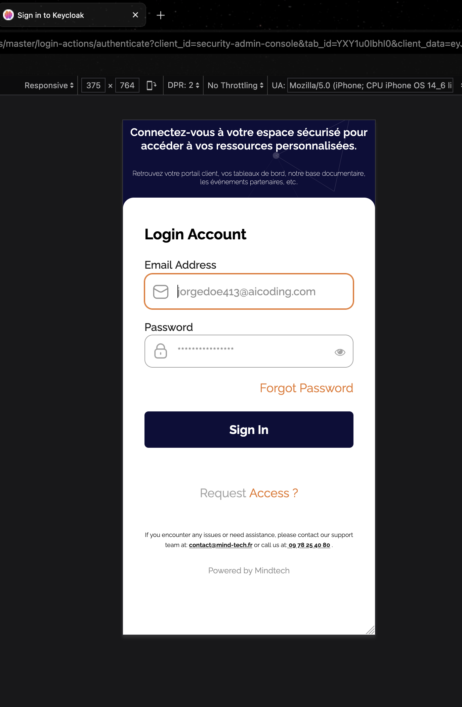

## Set-Up Instructions

I have provided a Dockerfile that you can use to do a quick set-up and get up and running with the theme.

## Changing the Theme

After building the Docker iamge and running it via the provided Dockerfile, go to your Keycloak
admin panel, navigate to `Realm Settings` > `Themes`. 
Under `Login Theme`, you should be able to see `Mindtech` from the dropdown list. Select
it, then click save. Your theme will be picked automatically by Keycloak.

## Background Logo

The assumption is that you have deployed the logo to a cloud provider or cloud bucket of some sort. So, in the Dockerfile configuration above,
in the environment variable for `BACKGROUND_LOGO_URL`, you will typically add the URL as a string. 

However, if you do not prefer using this configuration, in your keycloak admin panel, navigate to, `Realm Settings` > `Realm Overrides` > click `Add Translation`. For the key, add, `backgroundLogoUrl` and for the value, add the URL to your logo only without the "". For this to work, first, make sure to have changed the theme to this custom theme.

## Sample Desktop View

## Sample Mobile View

